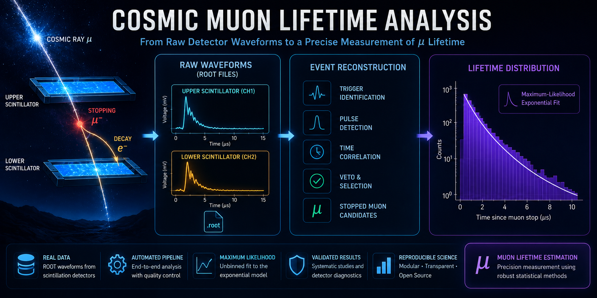

# Cosmic Muon Lifetime Analysis

<p align="center">
  <a href="https://github.com/naris93-phcs/muon-lifetime-analysis/releases">
    
  </a>
  
  
  
  <a href="LICENSE">
    
  </a>
</p>

<p align="center">
  
</p>

> **End-to-end scientific software for estimating the lifetime of atmospheric cosmic-ray muons from real scintillation detector waveform data.**

This project implements a complete data-analysis framework for experimental particle physics, transforming raw oscilloscope waveforms stored in **ROOT** format into statistically validated muon lifetime measurements.

The software performs the entire analysis workflow automatically, including waveform processing, stopped-muon candidate identification, detector quality control, maximum-likelihood lifetime estimation, validation studies and publication-quality figures, detector diagnostics and statistical visualizations..

---

## Highlights

- Processing of real scintillation-detector waveforms stored in ROOT files.
- Automated identification of stopped-muon decay candidates.
- Coincidence-based event rejection and detector quality control.
- Modular and reusable scientific Python architecture.
- Unbinned maximum-likelihood lifetime estimation.
- Exponential-tail and fit-range stability studies.
- Automatic generation of accepted and rejected event diagnostics.
- Reproducible analysis of multiple experimental runs.

---

## Contents

- [Physics Motivation](#physics-motivation)
- [Experimental Setup](#experimental-setup)
- [Repository Structure](#repository-structure)
- [Installation](#installation)
- [Usage](#usage)
- [Analysis Pipeline](#analysis-pipeline)
- [Detector Algorithm](#detector-algorithm)
- [Statistical Analysis](#statistical-analysis)
- [Performance & Results](#performance--results)
- [Detector Validation](#detector-validation)
- [Future Improvements](#future-improvements)
- [Software Stack](#software-stack)
- [Acknowledgements](#acknowledgements)
- [License](#license)

---

# Physics Motivation

Atmospheric cosmic-ray muons are continuously produced when high-energy primary cosmic rays interact with nuclei in the Earth's atmosphere.

A fraction of these muons lose enough energy to stop inside a scintillation detector before decaying according to

**μ⁻ → e⁻ + ν̄ₑ + νμ**

or

**μ⁺ → e⁺ + νₑ + ν̄μ**

The characteristic lifetime of a free muon is approximately **2.197 μs**.

Experimentally measuring this quantity, however, is considerably more challenging than simply fitting an exponential distribution. It requires identifying genuine stopped-muon events among thousands of detector waveforms while rejecting noise, accidental coincidences and detector artefacts.

This repository provides an end-to-end framework that automates this process, from raw waveform acquisition to statistical lifetime estimation, while exposing every intermediate analysis step for validation and quality control.

---

# Experimental Setup

The detector consists of plastic scintillators instrumented with photomultiplier tubes (PMTs). Detector signals are digitized using a digital oscilloscope and stored as ROOT files for offline analysis.

For every recorded waveform, the analysis searches for the characteristic signature of a stopped cosmic-ray muon:

1. A muon enters the detector and deposits its remaining kinetic energy.
2. The muon comes to rest inside the scintillator.
3. After a short delay, the muon decays.
4. The emitted decay electron produces a second scintillation pulse.
5. The time difference between both pulses is interpreted as the measured decay time.

Only events satisfying all detector-selection criteria are accepted for the final statistical analysis.

---

# Repository Structure

```text
muon-lifetime-analysis
│
├── data/
│   └── ROOT waveform files
│
├── diagnostics/
│   └── Detector validation figures
│
├── results/
│   └── Analysis outputs
│
├── src/
│   ├── analysis.py
│   ├── config.py
│   ├── detector.py
│   ├── io.py
│   ├── pipeline.py
│   ├── reporting.py
│   └── workflow.py
│
├── main.py
├── validate_runs.py
├── README.md
└── requirements.txt
```

---

# Installation

```bash
git clone https://github.com/naris93-phcs/muon-lifetime-analysis.git

cd muon-lifetime-analysis

pip install -r requirements.txt
```

---

# Usage

Run the complete analysis pipeline:

```bash
python main.py
```

Run the validation suite:

```bash
python validate_runs.py
```

---

# Analysis Pipeline

The software follows a modular end-to-end analysis pipeline that separates detector logic, statistical analysis, reporting and data input/output into independent components.

```text
ROOT Waveforms
       │
       ▼
+------------------+
|     io.py        |
| Waveform Loader  |
+------------------+
       │
       ▼
+------------------+
|   detector.py    |
| Pulse Detection  |
+------------------+
       │
       ▼
+------------------+
|   pipeline.py    |
| Candidate Logic  |
+------------------+
       │
       ▼
+------------------+
|   analysis.py    |
| Statistical Fit  |
+------------------+
       │
       ▼
+------------------+
|  reporting.py    |
| Figures & Tables |
+------------------+
       │
       ▼
Results
```

This modular design makes each stage of the analysis independently testable, easier to validate and straightforward to extend for future detector configurations or analysis techniques.

---


---

# Statistical Analysis

The accepted decay-time candidates are analysed using maximum-likelihood estimation (MLE) to estimate the characteristic muon lifetime.

The analysis does not rely on a single fit result alone. Instead, it evaluates how the inferred lifetime changes when different lower fit boundaries are applied to the decay-time distribution.

This approach makes it possible to identify detector and reconstruction effects that predominantly influence the earliest accepted events and provides a more transparent interpretation of the final result.

---

## Exponential Tail Analysis

For an ideal detector, the decay-time distribution of stopped muons is expected to follow an exponential decay law.

In the experimental dataset, however, the earliest accepted events contain additional structure that is not fully described by a single exponential model. For this reason, the late-time region of the distribution is studied separately.

An exponential model is fitted to the tail of the spectrum beginning at:

**t ≥ 1.5 μs**

The fitted model is then extrapolated backwards towards earlier decay times. This allows the observed distribution to be compared directly with the behaviour expected from the late-time exponential component.

<p align="center">

</p>

<p align="center">
<b>Figure 3.</b> Exponential model fitted to the late-time region of the accepted decay-time distribution. The fitted tail is extrapolated towards earlier times, revealing an excess of short-delay events relative to the exponential expectation.
</p>

The backward extrapolation shows that the number of events observed at short delay times is larger than predicted by the late-time exponential model.

This early-time excess is consistent with detector-response, triggering, pulse-reconstruction, or event-selection effects that become increasingly important close to the coincidence trigger.

Rather than removing or hiding this behaviour, the analysis displays it explicitly so that the limitations of the measurement remain visible and scientifically interpretable.

---

## Maximum-Likelihood Lifetime Estimation

The characteristic lifetime is estimated using an unbinned maximum-likelihood method.

For each selected fit interval, the estimator uses the individual reconstructed decay times rather than relying only on histogram bin contents.

The nominal analysis range is:

**0.80 μs ≤ t ≤ 6.00 μs**

Within this interval, the analysis contains:

**6,612 accepted decay candidates**

The resulting lifetime estimate is:

**τ = 1.0340 ± 0.0139 μs**

The quoted uncertainty represents the statistical uncertainty associated with the selected event sample and fit interval.

The measured value should therefore be interpreted as the result of the complete detector and reconstruction pipeline under the nominal event-selection criteria, rather than as a direct measurement of the free positive-muon lifetime.

---

## Fit-Range Stability Study

To evaluate the robustness of the lifetime estimate, the maximum-likelihood analysis is repeated using several lower fit boundaries while the upper boundary remains fixed.

This procedure tests how strongly the inferred lifetime depends on the inclusion of early-time events.

<p align="center">

</p>

<p align="center">
<b>Figure 4.</b> Fit-range stability study showing the estimated lifetime as a function of the lower fit boundary.
</p>

The resulting lifetime estimates are:

| Lower fit boundary, t<sub>min</sub> (μs) | Estimated lifetime, τ (μs) |
|---:|---:|
| 0.80 | 1.0340 |
| 1.00 | 1.0728 |
| 1.20 | 1.2964 |
| 1.50 | 1.7753 |
| 2.00 | 1.9559 |

The estimated lifetime increases as the lower fit boundary is shifted towards later decay times.

This trend indicates that the earliest part of the reconstructed distribution is not governed solely by the physical decay law. Instead, it is influenced by the time-dependent efficiency of the detector and reconstruction algorithm.

At larger lower-cut values, the fit becomes less sensitive to these early-time effects and moves closer to the expected free-muon lifetime. However, the number of available events is simultaneously reduced, increasing the statistical uncertainty.

The fit-range study therefore provides an essential systematic cross-check and demonstrates the balance between reducing detector bias and retaining sufficient statistical precision.

---

## Interpretation of the Result

The analysis shows that the reconstructed decay-time distribution contains two clearly distinguishable regimes:

- an early-time region affected by detector and reconstruction effects,
- and a later-time region that more closely follows exponential decay behaviour.

The nominal result provides the most statistically precise estimate under the default selection criteria, while the tail analysis and fit-range study reveal the systematic dependence of the measurement on the chosen fitting interval.

This distinction is important because it prevents the reported lifetime from being presented as an isolated number without context.

The software therefore reports not only the estimated lifetime, but also the diagnostic information required to understand how that value was obtained and why it changes under different analysis choices.

---

# Performance & Results

The complete analysis was performed on a dataset consisting of ROOT waveform files acquired with a two-scintillator cosmic-ray detector.

The software automatically processed all detector files, reconstructed candidate stopped-muon decays, performed event classification and estimated the muon lifetime using an unbinned maximum-likelihood approach.

The final analysis produced the following summary:

| Metric | Value |
|:---|---:|
| ROOT files processed | 18 |
| Files skipped | 1 |
| Total detector candidates | 25,495 |
| Accepted decay candidates | 6,963 |
| Rejected candidates | 18,532 |
| Events used in nominal fit | 6,612 |
| Nominal fit range | 0.80–6.00 μs |
| Estimated lifetime | **1.0340 ± 0.0139 μs** |

The complete analysis pipeline executes automatically, producing detector diagnostics, event-classification figures, statistical summaries and lifetime estimates without manual intervention.

---

# Detector Validation

Reliable lifetime measurements require not only a robust statistical analysis but also a thoroughly validated event-selection algorithm.

For this reason, the detector pipeline was validated independently before performing the final lifetime estimation. Every stage of the reconstruction was visually inspected and tested using dedicated diagnostic outputs generated automatically during the analysis.

The validation procedure included:

- verification of trigger identification,
- pulse detection and peak reconstruction,
- coincidence and veto logic,
- accepted and rejected event inspection,
- detector-response diagnostics,
- exponential-tail consistency checks,
- fit-range stability studies.

Rather than treating the detector as a "black box", the reconstruction process remains fully transparent. Intermediate products are saved throughout the analysis, allowing individual events to be reviewed and detector decisions to be verified visually.

This validation strategy provides confidence that the reported lifetime estimate reflects the behaviour of the reconstruction pipeline and allows potential detector-induced systematic effects to be identified and investigated.
The diagnostic outputs generated by the software are intended not only for debugging but also for long-term detector development. As additional datasets become available, the same validation framework can be reused without modifying the analysis pipeline, ensuring reproducibility across future measurements.

---

# Future Improvements

The current implementation provides a complete and reproducible workflow for stopped-muon lifetime analysis. Nevertheless, several extensions could further improve the precision, robustness and applicability of the software.

Potential future developments include:

- Detector efficiency corrections.
- Dead-time and trigger-efficiency studies.
- Bootstrap and Monte Carlo uncertainty estimation.
- Bayesian lifetime inference.
- Automatic detector calibration routines.
- Pulse-shape classification using machine learning.
- Native ROOT/C++ implementation for large-scale datasets.
- Support for additional detector geometries and acquisition systems.
- Parallel processing for high-statistics analyses.
- GPU-accelerated waveform processing for very large datasets.

The modular architecture of the repository allows these features to be incorporated with minimal changes to the existing analysis pipeline.

---

# Software Stack

The project is built entirely with open-source scientific computing tools.

- Python
- NumPy
- SciPy
- Matplotlib
- Uproot
- Awkward Array
- pathlib

---

# Acknowledgements

This project was developed as part of experimental particle physics studies within the MSc programme in **Subatomic Physics and Technological Applications** at the **Aristotle University of Thessaloniki (AUTH)**.

The analysis relies on the open-source scientific Python ecosystem, whose tools make reproducible research and detector-data analysis possible.

---

## Contributing

Contributions, suggestions and discussions are welcome.
Please open an issue or submit a pull request to help improve the project.

---

# License

This project is released under the MIT License.

## Citation

If you use this software in scientific work, please cite:

**Naris D.**
*Cosmic Muon Lifetime Analysis.*
GitHub repository, 2026.
Version 3.0.