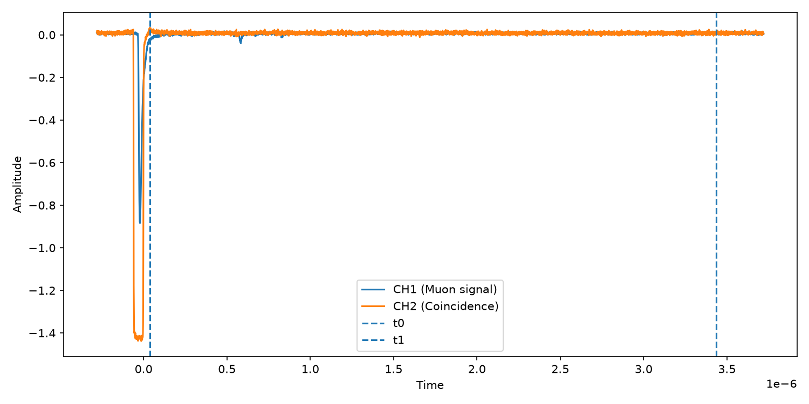
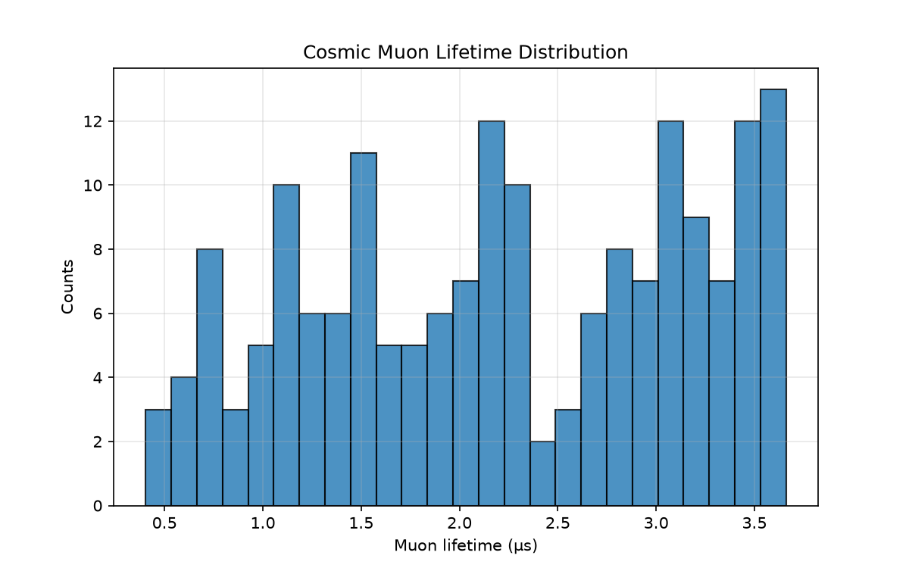

<<<<<<< HEAD
# Cosmic Muon Lifetime Analysis from Scintillation Detector Data

Python analysis pipeline for estimating the lifetime of atmospheric cosmic-ray muons using real oscilloscope waveform data recorded with a scintillation detector.

---

# Overview

Cosmic-ray muons are continuously produced in the Earth's atmosphere through interactions of high-energy cosmic rays with atmospheric nuclei.

Some of these muons stop inside a scintillation detector before decaying via the weak interaction

μ⁻ → e⁻ + ν̄ₑ + νμ

This project analyzes real oscilloscope waveforms, identifies candidate decay events, measures the delay between the stopping muon and the decay electron, and estimates the mean muon lifetime.

---

# Physics Background

The probability of muon decay follows an exponential distribution

N(t) = N₀ exp(-t/τ)

where

- **N(t)** is the number of surviving muons
- **τ** is the mean muon lifetime

Accepted value:

**τ = 2.197 μs**

The objective of this project is to reproduce this value from experimental data.

---

# Example Event

The figure below shows a representative oscilloscope waveform.

The large pulse corresponds to the stopping muon, while the smaller delayed pulse corresponds to the decay electron candidate.



---

# Lifetime Distribution

The extracted decay times are collected into a lifetime histogram.



Current analysis results

| Quantity | Value |
|-----------|--------|
| Events analyzed | 180 |
| Mean lifetime | **2.235 μs** |
| Standard deviation | **0.939 μs** |

The measured lifetime is in reasonable agreement with the accepted value considering the simplicity of the current event-selection algorithm.

---

# Analysis Pipeline

The analysis performs the following steps

1. Load oscilloscope CSV files
2. Extract waveform channels
3. Detect the coincidence trigger
4. Search for a delayed decay pulse
5. Compute the time interval between both signals
6. Build the lifetime distribution
7. Estimate the mean muon lifetime

---

# Repository Structure

```text
muon-lifetime-analysis
│
├── assets/
│   ├── example_event.png
│   └── lifetime_hist.png
│
├── data/
│   └── raw/
│
├── results/
│
├── src/
│   ├── analysis.py
│   ├── detector.py
│   ├── io.py
│   ├── lifetime.py
│   ├── plotting.py
│   └── preprocessing.py
│
├── main.py
├── requirements.txt
└── README.md
```

---

# Installation

Clone the repository

```bash
git clone https://github.com/naris93-phcs/muon-lifetime-analysis.git
```

Install the required packages

```bash
pip install -r requirements.txt
```

---

# Usage

Run

```bash
python main.py
```

Typical output

```text
Found 180 files

========================
Muon Lifetime Analysis
========================
Events used: 180
Mean lifetime = 2.235 μs
Std deviation = 0.939 μs
========================
```

---

# Current Limitations

The current implementation uses a simple peak-selection algorithm to identify the delayed decay signal.

Future versions will improve event selection by introducing

- adaptive thresholds
- baseline subtraction
- pulse prominence
- pulse width selection
- event quality cuts
- exponential lifetime fitting
- uncertainty estimation

---

# Future Work

Planned improvements include

- Improved pulse detection using SciPy
- Robust exponential decay fitting
- Automatic event quality classification
- Interactive waveform inspection
- ROOT implementation
- Comparison with Monte Carlo simulations
- Statistical uncertainty estimation

---

# Technologies

- Python
- NumPy
- Pandas
- Matplotlib

---

# Status

**Version 1.0**

✔ Working analysis pipeline

✔ Real experimental data

✔ Automatic lifetime extraction

✔ Histogram generation

✔ Statistical analysis

---

# License

This project is intended for educational and scientific purposes.
=======
# Muon Lifetime Analysis

This project analyzes raw detector data from a muon decay experiment.

## What it does
- Loads waveform data (TIME, CH1, CH2)
- Detects muon events
- Uses coincidence signal (CH2) for filtering
- Extracts muon decay times
- Fits exponential decay to estimate lifetime

## Physics model
Muon decay follows:
N(t) = N0 * exp(-t / τ)

where τ is the muon lifetime.

## Goal
Estimate the muon lifetime from experimental data.
>>>>>>> origin/main
