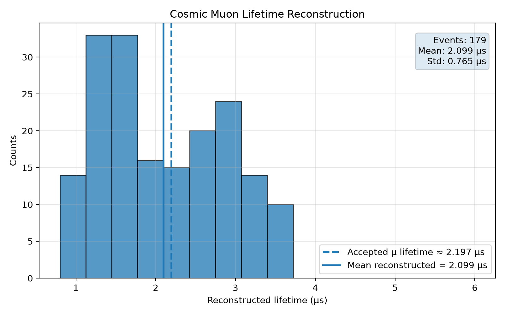

# Cosmic Muon Lifetime Analysis


Python-based scientific analysis pipeline for reconstructing the lifetime of atmospheric cosmic-ray muons using real scintillation detector waveform data.

---

## Status

**Completed (Python Version)**

This release focuses on detector development, waveform reconstruction and scientific analysis using Python.

A future version of this project will extend the analysis using **ROOT** and **C++** on a significantly larger dataset.

---

# Contents

- Overview
- Features
- Experimental Setup
- Installation
- Usage
- Detector Algorithm
- Project Structure
- Results
- Lifetime Histogram
- Diagnostics
- Limitations
- Future Work
- Acknowledgements
- License

---

# Overview

Cosmic-ray muons are continuously produced in the Earth's atmosphere through interactions of high-energy cosmic rays with atmospheric nuclei.

A fraction of these muons lose enough kinetic energy to stop inside a scintillation detector before decaying into an electron (or positron) and neutrinos.

This repository reconstructs the time delay between the stopping muon and its subsequent decay by analysing real oscilloscope waveforms recorded during a laboratory experiment.

Rather than focusing solely on obtaining the correct muon lifetime, the objective of this project is to demonstrate a realistic particle detector analysis workflow including

- waveform loading
- trigger reconstruction
- delayed pulse detection
- detector development
- diagnostics
- statistical analysis
- scientific documentation

---

# Features

- Automatic oscilloscope CSV parsing
- Coincidence trigger reconstruction
- Dual-polarity pulse detection
- Peak prominence based event selection
- Early-time veto
- Lifetime reconstruction
- Histogram generation
- Detector diagnostics
- Pulse statistics
- Automatic summary report

---

# Experimental Setup

The experimental setup consists of two plastic scintillation detectors coupled to photomultiplier tubes (PMTs).

The recorded oscilloscope channels are

| Channel | Description |
|----------|-------------|
| CH1 | Analog scintillator waveform |
| CH2 | Coincidence trigger signal |

The coincidence signal defines the trigger time of the event.

A delayed pulse detected in CH1 is interpreted as the decay-electron candidate.

The dataset consists of real oscilloscope waveforms acquired during a laboratory cosmic muon lifetime experiment.

---

# Installation

Clone the repository

```bash
git clone https://github.com/naris93-phcs/muon-lifetime-analysis.git

cd muon-lifetime-analysis
```

Create a virtual environment

```bash
python -m venv .venv
```

Activate it

Windows

```bash
.venv\Scripts\activate
```

Linux / macOS

```bash
source .venv/bin/activate
```

Install the required packages

```bash
pip install -r requirements.txt
```

---

# Usage

Run the full analysis

```bash
python main.py
```

Generate the analysis summary

```bash
python diagnostics/summary_report.py
```

Generate the publication histogram

```bash
python diagnostics/publication_histogram.py
```

---

# Detector Algorithm

The detector reconstruction follows these steps

1. Load waveform data
2. Reconstruct the trigger time from CH2
3. Apply an early-time veto
4. Search CH1 for delayed pulse candidates
5. Detect both positive and negative pulse candidates
6. Rank candidates using peak prominence
7. Select the most prominent delayed pulse
8. Compute the reconstructed lifetime

The final detector (v2.0) is a **dual-polarity prominence-based detector with an early-time veto**.

---

# Project Structure

```text
muon-lifetime-analysis/

├── data/
│   └── raw/
│
├── docs/
│   └── publication_lifetime_hist.png
│
├── diagnostics/
│   ├── plot_detector_diagnostics.py
│   ├── pulse_statistics.py
│   ├── summary_report.py
│   ├── mle_lifetime.py
│   └── publication_histogram.py
│
├── src/
│   ├── io.py
│   ├── detector.py
│   ├── lifetime.py
│   └── analysis.py
│
├── main.py
├── requirements.txt
└── README.md
```

---

# Current Detector Configuration

| Parameter | Value |
|------------|------:|
| Trigger channel | CH2 |
| Search channel | CH1 |
| Early-time veto | 0.8 μs |
| Pulse search | Dual polarity |
| Selection metric | Peak prominence |
| Maximum accepted lifetime | 10 μs |

---

# Results

Current reconstruction

| Quantity | Value |
|-----------|------:|
| Input waveforms | 180 |
| Reconstructed events | 179 |
| Detection efficiency | 99.4 % |
| Mean reconstructed lifetime | 2.099 μs |
| Standard deviation | 0.765 μs |

The reconstructed lifetime is close to the accepted free-muon lifetime (~2.2 μs).

This implementation should be regarded as a **detector-development study** rather than a precision lifetime measurement.

---

# Lifetime Histogram



---

# Diagnostics

Several utilities were developed to validate detector performance.

| Script | Purpose |
|----------|----------|
| plot_detector_diagnostics.py | Visual inspection of reconstructed events |
| pulse_statistics.py | Pulse height, width and prominence statistics |
| summary_report.py | Automatic reconstruction summary |
| mle_lifetime.py | Experimental MLE study |
| publication_histogram.py | Publication-quality histogram |

These tools were used during detector optimisation and validation.

---

# Limitations

The current analysis intentionally remains simple.

The following effects are not included

- detector acceptance correction
- detector efficiency correction
- background subtraction
- systematic uncertainties
- full maximum-likelihood reconstruction
- pulse-shape template fitting

Therefore, the reconstructed lifetime should be interpreted as the output of the current detector algorithm rather than a precision measurement of the physical muon lifetime.

---

# Future Work

Planned improvements include

- pulse-shape discrimination
- adaptive detector thresholds
- detector efficiency studies
- uncertainty propagation
- full statistical lifetime extraction
- ROOT/C++ implementation
- large-scale ROOT dataset analysis

---

# Acknowledgements

This repository was developed as a personal scientific software project using real experimental waveform data acquired during a laboratory cosmic muon lifetime measurement.

The objective of the project is educational: to gain practical experience in detector development, scientific programming and particle physics data analysis.

---

# License

This project is released under the MIT License.